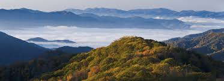
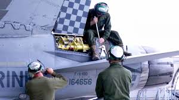
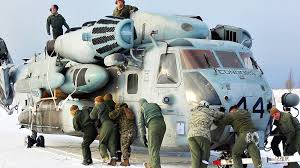
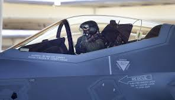

# Biography of Justin Smallwood

### I was born in east Tennessee in 1988. In 2008 I graduated High School and joined the Marine Corps afterwards. I was 20 years old. I have been in the Marine Corps for 10 years. I have spent 6 years in Japan and love it. My main job in the Marine Corps is to repair multimillion dollar aircraft. In 2009 I was stationed in Iwakuni, Japan to repair Fixwing Aircraft. Then the worst happaned and I was stationed in Camp Pendleton, Califorina to repair Rotary Aircraft. In 2014 I moved back to Iwakuni, Japan to repair the F35. In 2018, I started back at College at UMUC.

1. 1988 I was born.
2. 2008 I graduated High School.
3. 2009 i was stationed in [Iwakuni Japan](https://www.mcasiwakuni.marines.mil/).
4. 2014 I was stationed in [Camp Pendleton](https://www.pendleton.marines.mil/).
5. 2014 November I was stationed in [Iwakuni Japan](https://www.mcasiwakuni.marines.mil/).
6. 2018 January I started college at UMUC.

### East Tennessee

### Me working on F18  
  
### Me working on CH53
  
### Me working on F35
  
### Me at UMUC
  

[home](index)
